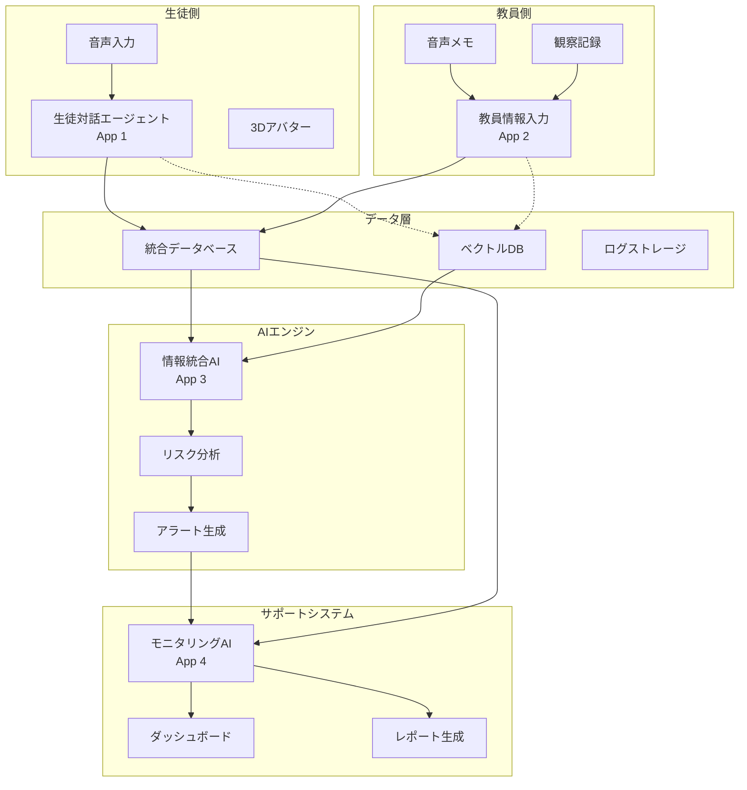
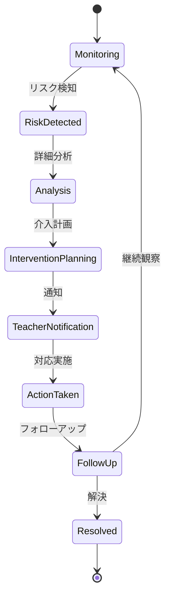
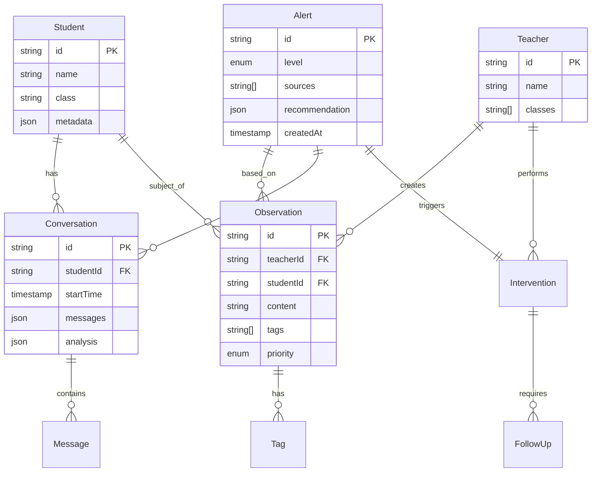
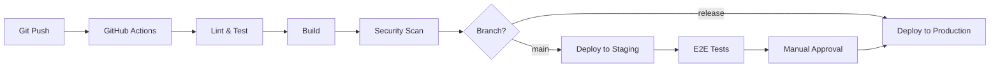

# システムアーキテクチャ

## 全体構成図



## コンポーネント詳細

### 1. 生徒対話エージェント（App 1）

#### 現在の実装
- **技術スタック**: React + TypeScript + Three.js
- **LLM**: SambaNova AI (Llama-4-Maverick)
- **音声認識**: Web Speech Recognition API

#### アーキテクチャ
```
src/
├── components/
│   ├── avatar-chat-app.tsx      # メインオーケストレーター
│   ├── avatar-scene.tsx          # 3Dアバター制御
│   ├── chat-history.tsx          # チャット履歴管理
│   └── mic-control.tsx           # 音声入力制御
├── hooks/
│   ├── use-chat-messages.tsx     # メッセージ状態管理
│   └── use-speech-recognition.tsx # 音声認識フック
└── lib/
    └── api.ts                    # LLM API統合
```

#### データフロー
1. 音声入力 → Speech Recognition API
2. テキスト変換 → LLM処理
3. ストリーミングレスポンス → タイプライター効果
4. アバター制御 → Three.js アニメーション

### 2. 教員情報入力システム（App 2）

#### 設計方針
- **プラットフォーム**: PWA（Progressive Web App）
- **オフライン対応**: Service Worker + IndexedDB
- **認証**: JWT Bearer Token

#### 主要機能
```typescript
interface TeacherInput {
  id: string;
  timestamp: Date;
  type: 'observation' | 'concern' | 'incident';
  studentId: string;
  content: string;
  tags: string[];
  priority: 'low' | 'medium' | 'high';
  attachments?: File[];
}
```

#### API設計
```yaml
POST /api/teacher/observations
  Body: TeacherInput
  Response: { id: string, status: 'accepted' }

GET /api/teacher/observations
  Query: { date?: string, studentId?: string }
  Response: TeacherInput[]
```

### 3. 情報統合＆アラートAI（App 3）

#### 処理パイプライン

```python
# 情報統合フロー
class InformationIntegrator:
    def __init__(self):
        self.sources = [
            StudentDialogueSource(),
            TeacherObservationSource(),
            AttendanceSource(),
            GradeSource()
        ]

    def process(self):
        # 1. データ収集
        raw_data = self.collect_from_sources()

        # 2. 正規化
        normalized = self.normalize_data(raw_data)

        # 3. 特徴抽出
        features = self.extract_features(normalized)

        # 4. リスク評価
        risk_score = self.evaluate_risk(features)

        # 5. アラート生成
        if risk_score > THRESHOLD:
            return self.generate_alert(features, risk_score)
```

#### リスク評価マトリクス

| リスクレベル | スコア | 対応 |
|------------|-------|------|
| 低 | 0-30 | 記録のみ |
| 中 | 31-60 | 注意喚起 |
| 高 | 61-80 | 即時アラート |
| 緊急 | 81-100 | 管理職通知 |

### 4. モニタリング＆サポートAI（App 4）

#### ダッシュボード構成

```tsx
interface DashboardLayout {
  overview: {
    activeAlerts: Alert[];
    weeklyTrends: TrendData[];
    riskHeatmap: HeatmapData;
  };
  students: {
    watchList: Student[];
    recentIncidents: Incident[];
    interventionHistory: Intervention[];
  };
  analytics: {
    classAtmosphere: AtmosphereMetrics;
    academicPerformance: PerformanceData;
    socialDynamics: SocialGraph;
  };
}
```

#### 介入支援ロジック



## データモデル

### エンティティ関連図



## セキュリティ設計

### 認証・認可

```yaml
Authentication:
  Type: OAuth 2.0 / JWT
  Provider: School Identity Provider

Authorization:
  Roles:
    - admin: Full system access
    - teacher: Class-specific data
    - counselor: All student data (read-only)
    - student: Own data only

Data Privacy:
  - End-to-end encryption for sensitive data
  - PII masking in logs
  - GDPR/CCPA compliant
  - Data retention: 1 academic year
```

### データ保護

1. **暗号化**
   - 転送時: TLS 1.3
   - 保存時: AES-256-GCM
   - キー管理: AWS KMS / Azure Key Vault

2. **アクセス制御**
   - Role-Based Access Control (RBAC)
   - Attribute-Based Access Control (ABAC)
   - 最小権限の原則

3. **監査ログ**
   - すべてのデータアクセスを記録
   - 改ざん防止（ブロックチェーン検討）

## スケーラビリティ設計

### マイクロサービス構成（将来）

```yaml
Services:
  - student-dialogue-service
  - teacher-input-service
  - integration-engine-service
  - alert-service
  - monitoring-service
  - notification-service

Infrastructure:
  - Container: Docker
  - Orchestration: Kubernetes
  - Service Mesh: Istio
  - Message Queue: RabbitMQ / Kafka
  - Cache: Redis
  - Database: PostgreSQL (Primary) + MongoDB (Logs)
```

### パフォーマンス目標

| メトリクス | 目標値 |
|-----------|-------|
| API レスポンス時間 | < 200ms (p95) |
| アラート生成時間 | < 5秒 |
| 同時接続数 | 1000+ |
| 可用性 | 99.9% |

## 開発・デプロイメント

### CI/CDパイプライン



### 環境構成

| 環境 | 用途 | インフラ |
|------|------|---------|
| Development | 開発・テスト | Local Docker |
| Staging | 統合テスト | AWS ECS |
| Production | 本番運用 | AWS ECS + CloudFront |

## モニタリング＆運用

### 監視項目

1. **アプリケーション**
   - エラー率
   - レスポンスタイム
   - API使用状況

2. **インフラ**
   - CPU/メモリ使用率
   - ディスク容量
   - ネットワーク帯域

3. **ビジネス**
   - アクティブユーザー数
   - アラート生成数
   - 介入成功率

### ツールスタック

- **APM**: Datadog / New Relic
- **ログ管理**: ELK Stack
- **エラートラッキング**: Sentry
- **アラート**: PagerDuty