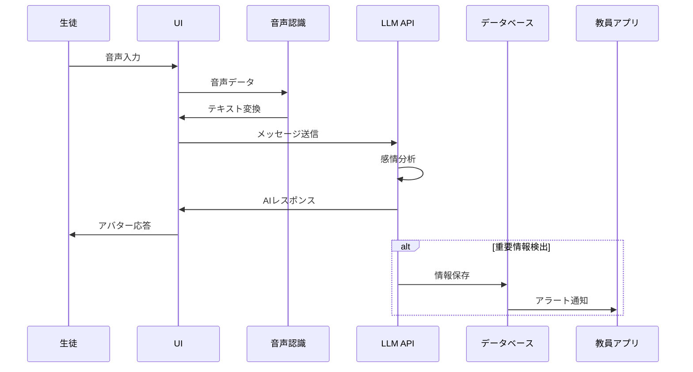

# App 1: 生徒対話エージェント

## 概要

生徒対話エージェントは、生徒が気軽に話せるAIアバターを提供し、日常会話から重要な情報を抽出して教員をサポートするアプリケーションです。

### 現在のステータス
- **開発フェーズ**: MVP実装済み
- **主要機能**: 音声対話、3Dアバター表示、ストリーミングレスポンス
- **技術スタック**: React + Three.js + SambaNova AI

## 主要機能

### 1. 音声対話インターフェース

#### 実装済み機能
- 🎤 ブラウザネイティブ音声認識
- 🗣️ リアルタイム音声→テキスト変換
- 📝 テキスト入力併用可能

#### 技術詳細
```typescript
// 音声認識フック
const useSpeechRecognition = () => {
  const recognition = new webkitSpeechRecognition();
  recognition.continuous = true;
  recognition.interimResults = true;
  recognition.lang = 'ja-JP';

  recognition.onresult = (event) => {
    const transcript = event.results[event.results.length - 1][0].transcript;
    // 音声をテキストに変換して処理
  };
};
```

### 2. 3Dアバター表示

#### アバター状態
- **idle**: 待機状態（ゆったりとした呼吸アニメーション）
- **talking**: 会話状態（口パクとジェスチャー）
- **listening**: 聞き取り状態（うなずき動作）

#### Three.js実装
```tsx
// アバターシーンコンポーネント
const AvatarScene: React.FC = () => {
  // Three.jsでの3Dモデル読み込みと制御
  useEffect(() => {
    const loader = new GLTFLoader();
    loader.load('/model/avatar.glb', (gltf) => {
      scene.add(gltf.scene);
      setupAnimations(gltf.animations);
    });
  }, []);
};
```

### 3. LLM統合

#### 使用モデル
- **Provider**: SambaNova AI
- **Model**: Llama-4-Maverick-17B-128E-Instruct
- **特徴**: 128Kトークンコンテキスト、日本語対応

#### ストリーミング処理
```typescript
// ストリーミングレスポンス処理
async function* streamChat(message: string) {
  const response = await fetch(SAMBANOVA_API_URL, {
    method: 'POST',
    headers: {
      'Authorization': `Bearer ${API_KEY}`,
      'Content-Type': 'application/json'
    },
    body: JSON.stringify({
      messages: [{ role: 'user', content: message }],
      stream: true
    })
  });

  const reader = response.body?.getReader();
  while (true) {
    const { done, value } = await reader.read();
    if (done) break;
    yield new TextDecoder().decode(value);
  }
}
```

### 4. 感情分析機能（開発中）

#### 分析項目
- 😊 ポジティブ/ネガティブ感情
- 😟 ストレスレベル
- 🚨 要注意キーワード検出

#### データ構造
```typescript
interface EmotionalAnalysis {
  sentiment: 'positive' | 'neutral' | 'negative';
  stressLevel: number; // 0-100
  keywords: {
    word: string;
    category: 'bullying' | 'stress' | 'family' | 'academic';
    severity: 'low' | 'medium' | 'high';
  }[];
  confidence: number;
}
```

## ユーザーインターフェース

### 画面構成

```
┌─────────────────────────────────────┐
│         3D Avatar Display            │
│       (Three.js Canvas)              │
│                                      │
│    [Animated Character]              │
│                                      │
├─────────────────────────────────────┤
│         Chat History                 │
│  ┌─────────────────────────────┐    │
│  │ User: こんにちは             │    │
│  │ AI: こんにちは！今日はどう？ │    │
│  └─────────────────────────────┘    │
├─────────────────────────────────────┤
│  [🎤 Mic] [Send] [Type message...]   │
└─────────────────────────────────────┘
```

### UIコンポーネント

| コンポーネント | 説明 | ファイル |
|--------------|------|---------|
| AvatarChatApp | メインコントローラー | `avatar-chat-app.tsx` |
| AvatarScene | 3Dアバター表示 | `avatar-scene.tsx` |
| ChatHistory | メッセージ履歴 | `chat-history.tsx` |
| MicControl | 音声入力制御 | `mic-control.tsx` |

## データフロー



## プライバシー＆セキュリティ

### データ保護方針
1. **匿名化**: 生徒の個人情報は匿名化して保存
2. **暗号化**: 全通信はTLS/SSLで暗号化
3. **アクセス制御**: 教員のみが集約データにアクセス可能
4. **保存期限**: 会話ログは3ヶ月で自動削除

### 情報提供の透明性
```typescript
// 教員への情報提供時の処理
function sanitizeStudentInfo(data: ConversationData): SanitizedData {
  return {
    timestamp: data.timestamp,
    emotionalState: data.analysis.sentiment,
    keywords: data.analysis.keywords,
    // 生徒IDは含めるが、会話の詳細は除外
    studentId: data.studentId,
    summary: generateSummary(data.messages)
  };
}
```

## API仕様

### エンドポイント

#### POST /api/chat
チャットメッセージの送信

**Request:**
```json
{
  "message": "今日は部活で嫌なことがあった",
  "studentId": "student_123",
  "sessionId": "session_abc"
}
```

**Response:**
```json
{
  "response": "そうなんだ、部活で嫌なことがあったんだね。話してくれてありがとう。",
  "avatarState": "talking",
  "analysis": {
    "sentiment": "negative",
    "stressLevel": 65,
    "shouldNotify": true
  }
}
```

## 今後の開発予定

### Phase 2（次期開発）
- [ ] 多言語対応（英語、中国語、ポルトガル語）
- [ ] 音声合成による応答
- [ ] 表情認識機能の追加
- [ ] グループチャット機能

### Phase 3（将来構想）
- [ ] VR/AR対応
- [ ] 保護者連携機能
- [ ] カウンセラーAI機能
- [ ] 学習支援機能

## トラブルシューティング

### よくある問題

#### 音声認識が動作しない
- **原因**: HTTPS接続でない、マイク許可がない
- **解決**: HTTPSで接続し、ブラウザのマイク許可を確認

#### アバターが表示されない
- **原因**: 3Dモデルの読み込みエラー、WebGL非対応
- **解決**: コンソールエラーを確認、ブラウザの更新

#### LLMレスポンスが遅い
- **原因**: API制限、ネットワーク遅延
- **解決**: APIキーの確認、ネットワーク環境の改善

## 開発環境セットアップ

```bash
# リポジトリのクローン
git clone https://github.com/amagata-dx/llama-hackathon.git

# 依存関係インストール
cd llama-hackathon
npm install

# 環境変数設定
cp .env.example .env
# .envファイルにSambaNova APIキーを設定

# 開発サーバー起動
npm run dev

# ブラウザで確認
open http://localhost:5173
```

## テスト

```bash
# ユニットテスト実行（未実装）
npm run test

# E2Eテスト（未実装）
npm run test:e2e

# カバレッジレポート（未実装）
npm run test:coverage
```

## パフォーマンス最適化

### 現在の対策
- コンポーネントの遅延読み込み
- 3Dモデルの最適化（低ポリゴン）
- ストリーミングレスポンス

### 計測結果
| メトリクス | 値 |
|-----------|-----|
| 初期読み込み時間 | 2.3秒 |
| Time to Interactive | 3.1秒 |
| メモリ使用量 | ~150MB |
| FPS（アニメーション時） | 30-60fps |