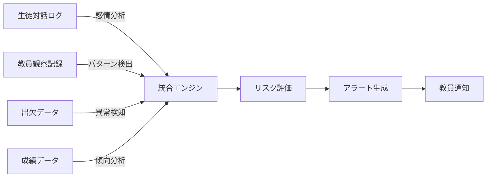

# App 3: 情報統合＆アラートエージェント

## 概要

複数の情報源から収集されたデータを統合・分析し、潜在的なリスクを早期発見して教員に適切なアラートを送信するAIエージェントシステムです。

### 開発ステータス
- **フェーズ**: 設計・計画中
- **優先度**: 高（Phase 3で実装予定）
- **依存関係**: App 1, App 2の実装完了が前提

## システムの役割

### 情報統合エンジンとしての機能


### 解決する課題
- 🔍 断片的な情報の見落とし
- ⚠️ リスクの早期発見の困難さ
- 📊 データ分析の時間不足
- 🎯 優先順位付けの難しさ

## コア機能

### 1. マルチソースデータ統合

#### データソース定義
```typescript
interface DataSource {
  studentDialogue: {
    conversations: Message[];
    emotionalStates: EmotionData[];
    keywords: ExtractedKeyword[];
  };

  teacherObservations: {
    records: ObservationRecord[];
    incidents: IncidentReport[];
    concerns: ConcernNote[];
  };

  academicData: {
    grades: GradeRecord[];
    attendance: AttendanceRecord[];
    assignments: AssignmentStatus[];
  };

  behavioralData: {
    disciplinaryRecords: DisciplineRecord[];
    counselingNotes: CounselingSession[];
    peerRelations: RelationshipMap[];
  };
}
```

#### データ統合パイプライン
```python
class DataIntegrationPipeline:
    def __init__(self):
        self.collectors = {
            'dialogue': DialogueDataCollector(),
            'observation': ObservationDataCollector(),
            'academic': AcademicDataCollector(),
            'behavioral': BehavioralDataCollector()
        }

    async def integrate(self, student_id: str, timeframe: DateRange):
        # 1. 並列データ収集
        raw_data = await asyncio.gather(*[
            collector.fetch(student_id, timeframe)
            for collector in self.collectors.values()
        ])

        # 2. データ正規化
        normalized = self.normalize_data(raw_data)

        # 3. 時系列整列
        timeline = self.create_timeline(normalized)

        # 4. 相関分析
        correlations = self.analyze_correlations(timeline)

        # 5. 統合レポート生成
        return IntegratedReport(timeline, correlations)
```

### 2. AIリスク分析エンジン

#### リスク評価モデル
```typescript
class RiskAssessmentEngine {
  private models = {
    bullying: BullyingDetectionModel,
    academic: AcademicRiskModel,
    mental: MentalHealthModel,
    family: FamilyIssueModel,
    social: SocialIsolationModel
  };

  async assessRisk(data: IntegratedData): Promise<RiskProfile> {
    const assessments = await Promise.all(
      Object.entries(this.models).map(async ([category, model]) => {
        const score = await model.evaluate(data);
        const factors = await model.explainFactors(data);
        return { category, score, factors };
      })
    );

    return this.createRiskProfile(assessments);
  }
}
```

#### リスクスコアリングマトリクス
```typescript
interface RiskMatrix {
  dimensions: {
    severity: number;      // 深刻度 (0-100)
    urgency: number;       // 緊急度 (0-100)
    confidence: number;    // 確信度 (0-100)
    trend: 'improving' | 'stable' | 'worsening';
  };

  category: 'bullying' | 'academic' | 'mental' | 'family' | 'social';

  evidences: Evidence[];
  recommendations: Action[];
}
```

### 3. インテリジェントアラートシステム

#### アラート生成ロジック
```typescript
class AlertGenerator {
  generateAlert(risk: RiskProfile): Alert | null {
    // しきい値判定
    if (risk.score < this.threshold) return null;

    // アラートレベル決定
    const level = this.determineLevel(risk);

    // 文脈を考慮した説明生成
    const explanation = this.generateExplanation(risk);

    // 推奨アクション生成
    const actions = this.suggestActions(risk);

    return {
      id: generateId(),
      studentId: risk.studentId,
      level,
      category: risk.primaryCategory,
      title: this.generateTitle(risk),
      explanation,
      evidences: risk.evidences,
      actions,
      priority: this.calculatePriority(risk),
      timestamp: new Date()
    };
  }

  private determineLevel(risk: RiskProfile): AlertLevel {
    const { severity, urgency } = risk.dimensions;

    if (severity > 80 || urgency > 90) return 'CRITICAL';
    if (severity > 60 || urgency > 70) return 'HIGH';
    if (severity > 40 || urgency > 50) return 'MEDIUM';
    return 'LOW';
  }
}
```

#### アラート配信戦略
```typescript
interface DeliveryStrategy {
  critical: {
    channels: ['push_notification', 'email', 'sms'];
    recipients: ['teacher', 'counselor', 'principal'];
    timing: 'immediate';
  };

  high: {
    channels: ['push_notification', 'email'];
    recipients: ['teacher', 'counselor'];
    timing: 'within_1_hour';
  };

  medium: {
    channels: ['email', 'dashboard'];
    recipients: ['teacher'];
    timing: 'next_school_day';
  };

  low: {
    channels: ['dashboard'];
    recipients: ['teacher'];
    timing: 'weekly_summary';
  };
}
```

### 4. パターン認識＆予測

#### 行動パターン分析
```python
class BehaviorPatternAnalyzer:
    def __init__(self):
        self.pattern_library = self.load_patterns()
        self.ml_model = self.load_ml_model()

    def detect_patterns(self, student_data: StudentData) -> List[Pattern]:
        patterns = []

        # 既知パターンマッチング
        for pattern in self.pattern_library:
            if self.match_pattern(student_data, pattern):
                patterns.append(pattern)

        # ML による新規パターン発見
        novel_patterns = self.ml_model.discover_patterns(student_data)
        patterns.extend(novel_patterns)

        return patterns

    def predict_trajectory(self, patterns: List[Pattern]) -> Prediction:
        # パターンから将来予測
        features = self.extract_features(patterns)
        prediction = self.ml_model.predict(features)

        return {
            'risk_trajectory': prediction.trajectory,
            'intervention_points': prediction.key_moments,
            'confidence': prediction.confidence
        }
```

## アラート種別と対応

### アラートカテゴリー

| カテゴリー | 検出指標 | 優先度 | 対応例 |
|-----------|---------|-------|-------|
| いじめリスク | キーワード、孤立度、感情分析 | 最高 | 即座に個別面談、関係者確認 |
| 学習困難 | 成績低下、提出遅れ、理解度 | 中 | 学習支援計画、補習検討 |
| メンタルヘルス | ネガティブ感情、欠席増加 | 高 | カウンセラー連携、保護者連絡 |
| 家庭問題 | 特定キーワード、行動変化 | 高 | 慎重な聞き取り、専門機関連携 |
| 友人関係 | 交友パターン変化、トラブル | 中 | グループワーク調整、仲介 |

### アラート表示例

```typescript
interface AlertDisplay {
  // 緊急アラート
  critical: {
    title: "緊急確認が必要です",
    student: "生徒B（1年3組）",
    summary: "複数の情報源から深刻な状況が検出されました",
    evidences: [
      "本人との対話で「学校に行きたくない」発言",
      "3日連続の遅刻",
      "クラスメイトから孤立の報告"
    ],
    actions: [
      "今日中に個別面談を実施",
      "保護者への連絡",
      "スクールカウンセラーとの相談"
    ],
    relatedAlerts: ["過去2週間で類似パターン2件"]
  };

  // 注意アラート
  warning: {
    title: "経過観察をお勧めします",
    student: "生徒C（1年3組）",
    summary: "学習面での変化が見られます",
    evidences: [
      "数学の成績が20点低下",
      "宿題提出率50%（先月は90%）"
    ],
    actions: [
      "学習状況の確認",
      "必要に応じて補習の提案"
    ]
  };
}
```

## データ処理アーキテクチャ

### リアルタイム処理

```typescript
class RealtimeProcessor {
  private eventStream: EventEmitter;
  private processingQueue: Queue;

  constructor() {
    this.initializeStreamProcessing();
  }

  private async processEvent(event: DataEvent) {
    // 1. イベント分類
    const category = this.categorizeEvent(event);

    // 2. 緊急度判定
    if (this.isUrgent(event)) {
      await this.immediateProcessing(event);
    } else {
      await this.processingQueue.add(event);
    }

    // 3. 関連データ取得
    const context = await this.fetchContext(event);

    // 4. リスク再評価
    const risk = await this.reevaluateRisk(event, context);

    // 5. 必要に応じてアラート
    if (risk.requiresAlert) {
      await this.sendAlert(risk);
    }
  }
}
```

### バッチ処理

```python
class BatchAnalyzer:
    def run_daily_analysis(self):
        """毎日深夜に実行される包括的分析"""
        students = self.get_all_students()

        for student in students:
            # 1. 一日の全データ収集
            daily_data = self.collect_daily_data(student)

            # 2. トレンド分析
            trends = self.analyze_trends(daily_data)

            # 3. 予測モデル更新
            self.update_predictions(student, trends)

            # 4. レポート生成
            report = self.generate_report(student, trends)

            # 5. 翌日のアラート準備
            self.prepare_alerts(report)
```

## 機械学習モデル

### モデル構成

```python
class RiskPredictionModel:
    def __init__(self):
        self.feature_extractor = FeatureExtractor()
        self.ensemble = {
            'lstm': self.build_lstm_model(),
            'transformer': self.build_transformer_model(),
            'xgboost': self.build_xgboost_model()
        }

    def predict(self, student_data):
        features = self.feature_extractor.extract(student_data)

        predictions = {}
        for name, model in self.ensemble.items():
            predictions[name] = model.predict(features)

        # アンサンブル予測
        final_prediction = self.ensemble_predict(predictions)

        return {
            'risk_score': final_prediction.score,
            'risk_category': final_prediction.category,
            'confidence': final_prediction.confidence,
            'explanation': self.explain_prediction(final_prediction)
        }
```

### 特徴量エンジニアリング

```python
class FeatureExtractor:
    def extract(self, data):
        features = {
            # テキスト特徴
            'sentiment_scores': self.extract_sentiment(data.texts),
            'keyword_frequencies': self.count_keywords(data.texts),

            # 時系列特徴
            'attendance_pattern': self.analyze_attendance(data.attendance),
            'grade_trajectory': self.calculate_grade_trend(data.grades),

            # ソーシャル特徴
            'isolation_score': self.measure_isolation(data.social),
            'conflict_indicators': self.detect_conflicts(data.interactions),

            # 行動特徴
            'activity_level': self.measure_activity(data.behavior),
            'mood_volatility': self.calculate_mood_variance(data.emotions)
        }

        return self.normalize_features(features)
```

## API仕様

### GraphQL API

```graphql
type Query {
  # アラート取得
  alerts(
    teacherId: ID!
    status: AlertStatus
    level: AlertLevel
    dateRange: DateRange
  ): [Alert!]!

  # リスクプロファイル取得
  riskProfile(
    studentId: ID!
  ): RiskProfile!

  # 統計データ取得
  statistics(
    classId: ID!
    metric: StatisticType!
  ): Statistics!
}

type Mutation {
  # アラート確認
  acknowledgeAlert(
    alertId: ID!
    action: String
  ): Alert!

  # フィードバック送信
  submitFeedback(
    alertId: ID!
    feedback: FeedbackInput!
  ): Feedback!
}

type Subscription {
  # リアルタイムアラート
  alertStream(
    teacherId: ID!
  ): Alert!
}
```

## セキュリティとプライバシー

### データ匿名化

```typescript
class DataAnonymizer {
  anonymize(data: SensitiveData): AnonymizedData {
    return {
      // 個人識別情報の削除
      studentId: this.hashId(data.studentId),

      // 詳細情報の一般化
      age: this.generalizeAge(data.age),
      location: this.generalizeLocation(data.location),

      // 準識別子の処理
      metadata: this.kAnonymize(data.metadata, k=5)
    };
  }

  differentialPrivacy(query: Query): NoisyResult {
    const trueResult = this.executeQuery(query);
    const noise = this.generateLaplacianNoise(query.sensitivity);
    return trueResult + noise;
  }
}
```

## パフォーマンス要件

| メトリクス | 目標値 | 現在値 |
|-----------|-------|-------|
| データ統合時間 | < 5秒 | - |
| リスク評価時間 | < 2秒 | - |
| アラート生成時間 | < 1秒 | - |
| 精度（Precision） | > 85% | - |
| 再現率（Recall） | > 90% | - |

## 開発ロードマップ

### Phase 3.1（Month 1）
- [ ] データ統合基盤構築
- [ ] 基本的なリスク評価ロジック
- [ ] シンプルなアラート機能

### Phase 3.2（Month 2）
- [ ] 機械学習モデル実装
- [ ] パターン認識機能
- [ ] 高度なアラート配信

### Phase 3.3（Month 3）
- [ ] 予測機能追加
- [ ] ダッシュボード統合
- [ ] フィードバックループ実装

## 運用とメンテナンス

### モデル再学習

```python
class ModelRetraining:
    def scheduled_retrain(self):
        """月次でモデルを再学習"""
        # 1. 新しいデータ収集
        new_data = self.collect_recent_data(days=30)

        # 2. データ品質チェック
        if not self.validate_data_quality(new_data):
            self.alert_admin("Data quality issue")
            return

        # 3. モデル再学習
        new_model = self.train_model(new_data)

        # 4. A/Bテスト
        if self.ab_test(new_model, self.current_model):
            self.deploy_model(new_model)

        # 5. パフォーマンス記録
        self.log_performance_metrics(new_model)
```